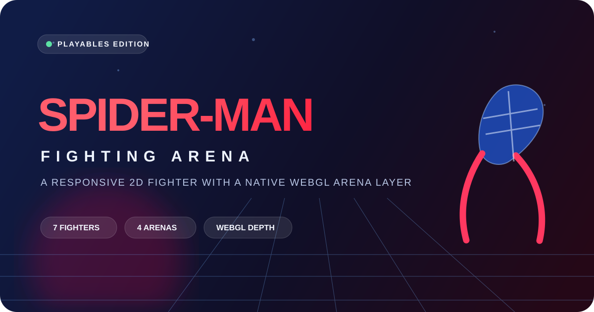

<div align="center">
  

  # Spider-Man Fighting Arena

  **A responsive browser fighter with arcade energy, native WebGL atmosphere, and YouTube Playables support.**

  `React` · `TypeScript` · `Canvas 2D` · `WebGL` · `Vite` · `YouTube Playables`
</div>

<br />

## The experience

Fight through a stylish, offline-first arena built for short, satisfying sessions. The combat renderer stays fast and deterministic on Canvas 2D, while a lightweight native WebGL layer adds stage-tinted light, a moving horizon grid, atmospheric glow, and depth behind the action. No large 3D engine is required.

> This is a fan project. It is not affiliated with, endorsed by, or associated with Marvel or Sony.

| Play | Progress | Presentation |
| :--- | :--- | :--- |
| Arcade Story · Local Versus · Daily Challenge | Cloud/local saves · achievements · match history | High-DPI canvas · adaptive touch controls · WebGL arena depth |
| Tutorial · Training · Combo Trials | Best score · daily score · player settings | pause-aware motion · reduced-motion option · haptics toggle |

## Features

- **Seven fighters** with individual styles, specials, colors, and combat stats.
- **Four arenas**: city skyline, rooftop sunset, subway station, and bridge.
- **Combat depth**: air attacks, throws, blocks, timed parries, special cooldowns, and combo trials.
- **Player-friendly design**: mobile controls, high contrast, larger text, reduced motion, audio sliders, and haptics.
- **YouTube Playables-ready lifecycle**: first-frame/game-ready signals, host mute, pause/resume, locale, health logging, cloud saves, and score submission.
- **No monetization APIs**: there are no ad, rewarded-ad, or interstitial requirements in this project.

## Platform builds — no Playgama required

This repository builds **the same game** for each storefront. There is no platform picker or platform branding inside the match experience.

| Target | Build key | Game integration |
| --- | --- | --- |
| YouTube Playables | `youtube` | Native YouTube lifecycle, cloud-save, audio, pause, and score bridge |
| Facebook Instant Games · Poki · CrazyGames | `facebook` · `poki` · `crazygames` | SDK-free HTML5 build with host events |
| Yandex Games · GameDistribution · Discord Activities | `yandex` · `gamedistribution` · `discord` | SDK-free HTML5 / embedded-game build with host events |
| JioGames · Y8 · Lagged | `jiogames` · `y8` · `lagged` | SDK-free HTML5 build with host events |
| Microsoft Store PWA | `microsoft-store` | PWA-ready web-game build with host events |
| Huawei & Xiaomi Quick Games | `huawei-xiaomi` | Web-game package with host events |
| MSN & Reddit Games | `msn-reddit` | Embedded web-game build with host events |

Non-YouTube targets do **not** load Playgama or a storefront SDK. Instead they publish standard browser events (`spider-arena:ready`, `spider-arena:state`, and `spider-arena:score`) so an optional store wrapper can connect later without changing the game or showing anything to players.

> Store certification and any required portal-specific packaging are still the publisher's responsibility. The generic builds intentionally contain no ads, monetization flows, or third-party platform SDKs.
## Controls

| Action | Player 1 | Player 2 (local versus) |
| --- | --- | --- |
| Move / jump | `WASD` or arrow keys | Numpad `4` `6` `8` |
| Block | `S` / Down | Numpad `5` |
| Punch / kick / web | `J` / `K` / `L` | Numpad `1` / `2` / `3` |
| Throw / timed parry | `H` / `P` | Numpad `7` / `9` |
| Special | `Space` | Numpad `0` |

Jump plus an attack to strike in the air. Time parry as a press—holding the key does not extend its window.

## Visual architecture

```text
WebGL canvas        → animated light, grid, stars, atmosphere (GPU)
Canvas 2D           → fighters, collisions, HUD-linked combat visuals
React game engine   → controls, AI, modes, rounds, persistence
YouTube bridge      → lifecycle, audio state, save/load, score reporting
```

The WebGL layer is intentionally decorative and isolated. If WebGL is unavailable, the Canvas 2D match still renders and plays normally.

## Run locally

```bash
npm ci
npm run dev
```

Then open the URL printed by Vite.

```bash
npm run build
npm run test -- --run

# One storefront target (for example, CrazyGames)
npm run build:platform -- crazygames

# Every configured platform target
npm run build:all-platforms
```

## Project map

```text
src/
├── components/
│   ├── GameCanvas.tsx           # deterministic combat renderer
│   ├── WebGLArenaBackdrop.tsx   # native WebGL visual layer
│   └── FightingGame.tsx         # menus, modes, profile, Playables wiring
├── hooks/
│   ├── useGameEngine.ts         # input, collisions, rounds, AI
│   └── useSoundEngine.ts        # procedural music/SFX, host mute support
└── lib/
    ├── playables.ts             # YouTube lifecycle and persistence bridge
    ├── gameModes.ts             # daily challenge, trials, profile data
    └── stages.ts                # Canvas arena artwork
```

## YouTube Playables release checklist

1. Create a production build with `npm run build`.
2. Test keyboard, touch, audio mute, pause/resume, save/load, each game mode, and narrow portrait through desktop viewports.
3. Upload the build through the YouTube Playables developer flow.
4. Validate the uploaded build in the [YouTube Playables Test Suite](https://developers.google.com/youtube/gaming/playables/test_suite).
5. Add the required metadata and artwork in the Developer Portal.

## Roadmap ideas

- Character-specific arcade endings and stage intros
- Ghost replays for daily challenges
- More combo trials, parry counter animations, and unlockable colorways
- Controller mapping and remappable keyboard controls

## License

Private project. Add a license before redistributing the source.
